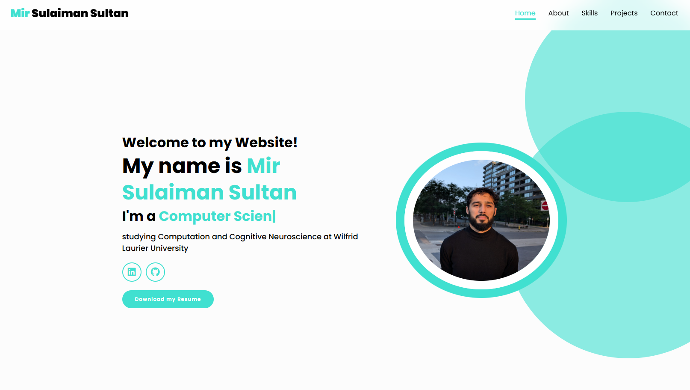
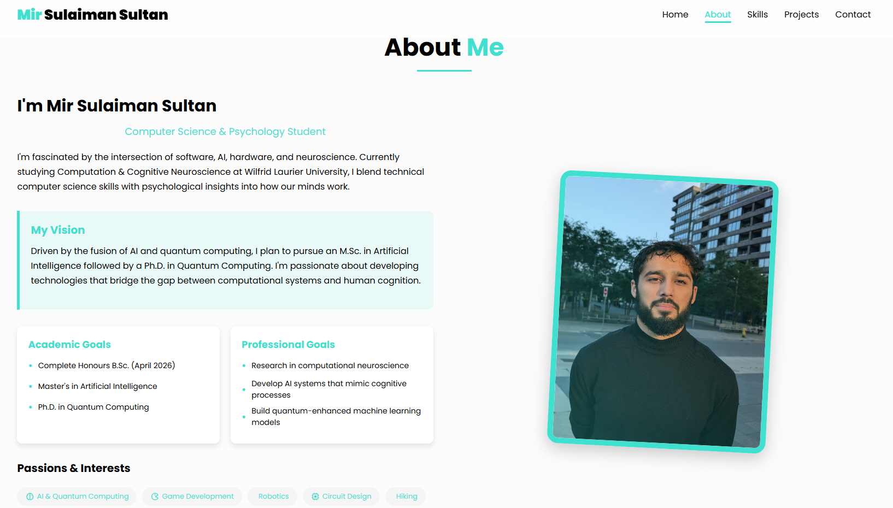

# Mir Sulaiman Sultan - Portfolio Website




A responsive and interactive personal portfolio website showcasing my skills, projects, and professional journey. Built with both vanilla HTML/CSS/JS and React versions to demonstrate versatility in front-end development.

## 📋 Overview

This portfolio website serves as a comprehensive digital resume highlighting my education, skills, and projects. The site features a clean, modern design with smooth animations, dark mode support, and mobile responsiveness.

## 🚀 Features

- **Responsive Design** - Seamlessly adapts to all device sizes
- **Dark/Light Mode Toggle** - Switch between themes based on preference
- **Interactive UI Elements** - Animated components and transitions
- **Flippable Skill Cards** - Interactive skill presentation
- **Contact Form** - Easy way to reach out
- **Project Filtering** - Filter projects by technology or category
- **Typewriter Effect** - Dynamic text animation on homepage

## 💻 Technologies Used

### HTML/CSS/JS Version
- HTML5
- CSS3 (with Flexbox and Grid layouts)
- Vanilla JavaScript
- Typed.js for typewriter animation
- Boxicons for icons

### React Version
- React.js
- Context API for state management
- CSS Modules
- React Hooks
- Typed.js integration
- Smooth animations

## 🛠️ Installation & Setup

### HTML/CSS/JS Version
1. Clone the repository:
   ```bash
   git clone https://github.com/SulaimanS11/portfolio.git